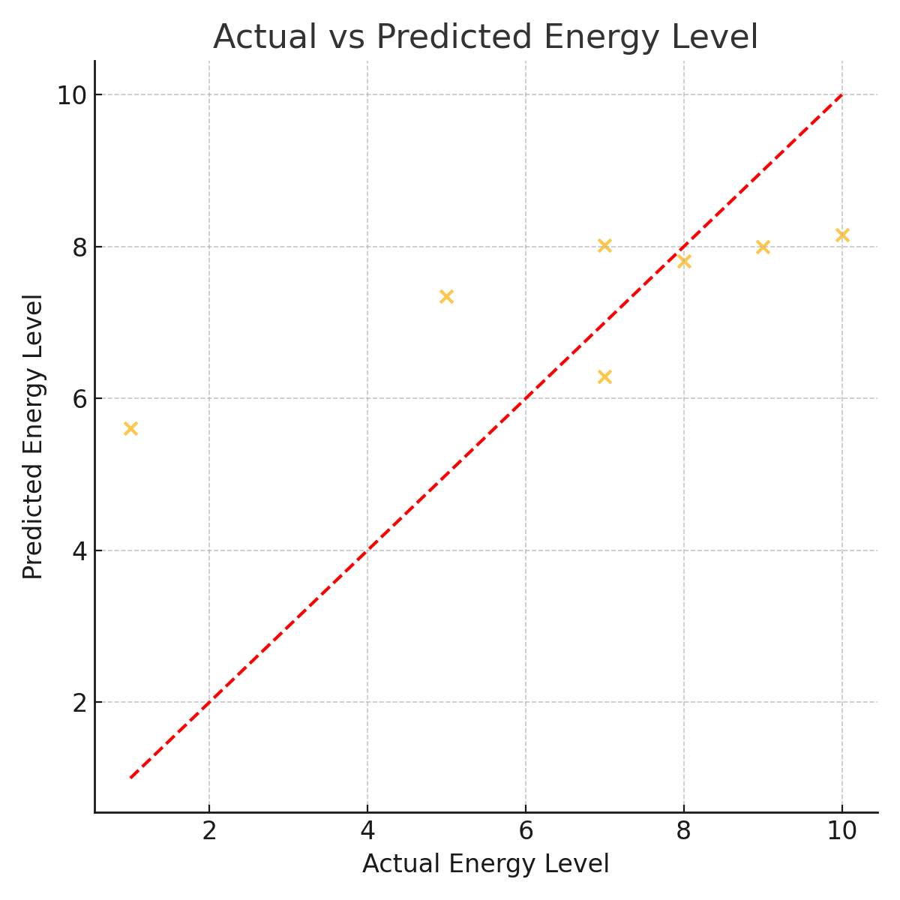

# DSA210-Term-Project: Diet, Exercise and Health Metrics

I am a student from Sabancı University, Toprak Aras and this is my DSA210 term project. 

---

## Hypothesis

**Diet and exercise significantly influence BMI, weight change, and energy levels.**

---

## Motivation

Understanding how daily habits such as nutrition, sleep, and exercise affect physical health is important for long-term well-being. This project uses real daily records to explore how inputs like calorie intake, workout intensity, and sleep quality relate to weight and energy levels.

---

## Project Goal

To analyze and model the impact of diet and physical activity on weight and energy levels using statistical methods and machine learning. Predictive models are built to estimate energy levels and weight changes from lifestyle inputs.

---

##  Data Sources and Preprocessing

The data was collected manually and exported from Apple Health and meal tracking logs. The file contains:
- **Daily records** of carbohydrates, proteins, calories, step count, sleep hours, sleep quality, workout intensity, energy levels, and weight.

**Preprocessing steps included:**
- Converting categorical columns (e.g., workout intensity) to numeric values
- Removing or imputing missing data
- Scaling numerical features using standardization

---

## Exploratory Data Analysis (EDA)

- Distribution analysis of key variables such as energy level and step count
- Correlation heatmaps between predictors and targets
- Boxplots and line charts to explore trends and outliers

---

## Hypothesis Testing

To evaluate the hypothesis that diet and exercise influence energy levels and weight, Pearson's correlation analysis was performed using `scipy.stats.pearsonr`.

Three variables — carbohydrate intake, protein intake, and step count — were compared against two health outcomes: energy levels and weight.

Here’s what the test showed:

- **Carbohydrate intake** showed a weak-to-moderate positive correlation with both energy levels (r = 0.39) and weight (r = 0.35), but these results were **not statistically significant** (p-values were above 0.05).  
- **Protein intake** had almost no correlation with either energy levels (r ≈ –0.04) or weight (r ≈ +0.20), and p-values indicated **no significance**.  
- **Step count** was weakly correlated with energy levels (r = 0.16) and weight (r = 0.24), but again, **no statistically significant relationships** were found.

**Conclusion:**  
Although there are weak positive trends in some relationships (especially for carbs and step count), **none of the p-values were below 0.05**. This means that, based on this dataset, we **fail to reject the null hypothesis (H₀)** — there is no strong statistical evidence that diet or exercise alone significantly impact energy levels or weight.

---

## Machine Learning Techniques

Daily energy levels (1–10) were predicted using regression models based on calorie intake, macros, step count, sleep, and workout intensity.

**Models Used:**
- K-Nearest Neighbors
- Decision Tree
- **Random Forest**

**Best Model:**  
Random Forest (R² ≈ 0.70, MAE ≈ 0.51)

### Evaluation Plots

#### Actual vs Predicted Energy Levels 
Shows prediction accuracy for the Random Forest model.



#### Feature Importances  
Highlights the most influential features (e.g., step count, sleep, workout).


For full model details and training code, see [Detailed Machine Learning Implementation](#detailed-machine-learning-implementation)

##  Visualizations

This section presents the key visual insights drawn from the project dataset.

---

### 1. Daily BMI Change Over Time
This line plot visualizes the day-to-day change in BMI based on weight records and a fixed height assumption. A red dashed line at zero helps identify whether the BMI increased or decreased on a given day.


---

### 2. Calories vs Energy Levels
This scatter plot shows the relationship between calorie intake and energy level ratings. The plot can indicate if higher calorie intake correlates with higher energy.


---

### 3. Daily Calorie Intake Trend
This line graph demonstrates daily caloric intake over time. It helps identify peaks, dips, and trends across days.


---

### 4. Carbohydrates vs Energy Levels
This scatter plot visualizes the relationship between carbohydrate intake (in grams) and energy levels. It helps assess if more carbs result in higher perceived energy.


---

### 5. Correlation Heatmap
The heatmap shows pairwise correlation values between input features and outcomes such as energy level and weight. This helps detect which features are most associated with health metrics.


---

### 6. Energy Levels Distribution
This histogram illustrates how frequently each energy level (from 1 to 10) occurs in the dataset. It helps understand common patterns in perceived energy.


---

### 7. Step Count vs Energy Levels
This scatter plot explores the relationship between number of steps taken and energy levels, providing insight into how physical activity affects perceived energy.


---

## Findings

- **Sleep effectivity** showed the strongest correlation with energy levels (r = 0.86), even though it wasn’t part of the formal hypothesis test.
- **Carbohydrate intake** and **step count** showed weak to moderate positive relationships with energy, but these were not statistically significant (p > 0.05).
- Nutritional variables (carb, protein) were not significantly correlated with energy or weight.
- **Random Forest** was the most accurate model for predicting energy levels, with an R² score of ~0.70 and MAE of ~0.51.

---

## Conclusion

While some trends were observable (e.g., higher carbs and more steps linked to higher energy), **no significant linear relationships** were found via Pearson correlation. However, machine learning models — especially Random Forest — were able to predict energy levels with reasonable accuracy. This suggests that **diet and exercise patterns may affect energy levels in nonlinear or combined ways**, which traditional correlation cannot fully capture.

---

## Detailed Machine Learning Implementation

Daily energy levels (1–10) were predicted using regression models based on calorie intake, macronutrients, sleep duration, sleep quality, workout intensity, and step count.

### Model Selection

Several regression models were tried, including:

- **K-Nearest Neighbors**
- **Decision Tree**
- **Random Forest**

Among these, **Random Forest Regressor** was selected as the final model because it performed the best in terms of accuracy and interpretability.

### Hyperparameters

The following hyperparameters were used for the `RandomForestRegressor`:

```python
RandomForestRegressor(
    n_estimators=100,
    max_depth=None,
    random_state=42
)
```

### Model Training Code

```python
from sklearn.ensemble import RandomForestRegressor
from sklearn.model_selection import train_test_split
from sklearn.metrics import mean_absolute_error, r2_score

# feature matrix and target
X = df[['CARB', 'PROTEIN', 'KCAL', 'STEP COUNT', 'SLEEP DURATION (HOUR)', 'SLEEP EFFECTIVITY (1-10)', 'WORKOUT INTENSITY']]
y = df['ENERGY LEVELS (1-10)']

# train-test split
X_train, X_test, y_train, y_test = train_test_split(X, y, test_size=0.2, random_state=42)

# model
rf = RandomForestRegressor(n_estimators=100, max_depth=None, random_state=42)
rf.fit(X_train, y_train)

# predictions
y_pred = rf.predict(X_test)

# evaluation
mae = mean_absolute_error(y_test, y_pred)
r2 = r2_score(y_test, y_pred)
```

- **R² Score:** ~0.70  
- **MAE:** ~0.51  

These metrics indicate that the model predicts energy levels fairly accurately.

---

### Evaluation Plots

**Actual vs Predicted Energy Levels**  
Points cluster around the red diagonal line, showing good alignment between predicted and real values.


**Feature Importances**  
The top predictors for energy were **sleep duration**, **protein intake**, and **sleep effectivity**.


