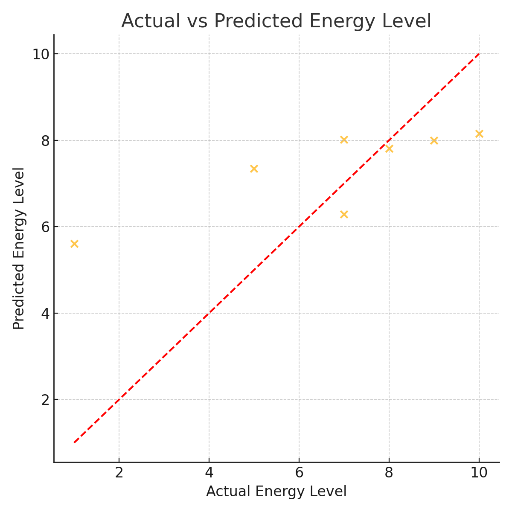
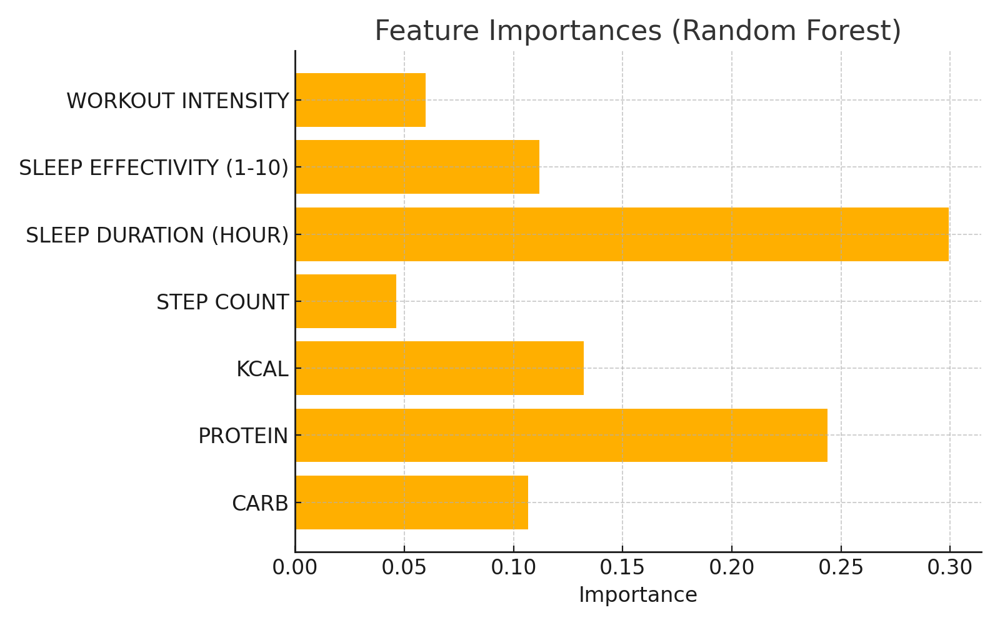

## Machine Learning Techniques

Daily energy levels (1–10) were predicted using regression models based on calorie intake, macronutrients, sleep duration, sleep quality, workout intensity, and step count.

### Model Selection

Several regression models were tried, including:

- **K-Nearest Neighbors**
- **Decision Tree**
- **Random Forest**

Among these, **Random Forest Regressor** was selected as the final model because it performed the best in terms of accuracy and interpretability.

### Hyperparameters

The following hyperparameters were used for the `RandomForestRegressor`:

```python
RandomForestRegressor(
    n_estimators=100,
    max_depth=None,
    random_state=42
)
```

### Model Training Code

```python
from sklearn.ensemble import RandomForestRegressor
from sklearn.model_selection import train_test_split
from sklearn.metrics import mean_absolute_error, r2_score

# feature matrix and target
X = df[['CARB', 'PROTEIN', 'KCAL', 'STEP COUNT', 'SLEEP DURATION (HOUR)', 'SLEEP EFFECTIVITY (1-10)', 'WORKOUT INTENSITY']]
y = df['ENERGY LEVELS (1-10)']

# train-test split
X_train, X_test, y_train, y_test = train_test_split(X, y, test_size=0.2, random_state=42)

# model
rf = RandomForestRegressor(n_estimators=100, max_depth=None, random_state=42)
rf.fit(X_train, y_train)

# predictions
y_pred = rf.predict(X_test)

# evaluation
mae = mean_absolute_error(y_test, y_pred)
r2 = r2_score(y_test, y_pred)
```

- **R² Score:** ~0.70  
- **MAE:** ~0.51  

These metrics indicate that the model predicts energy levels fairly accurately.

---

### Evaluation Plots

**Actual vs Predicted Energy Levels**  
Points cluster around the red diagonal line, showing good alignment between predicted and real values.



**Feature Importances**  
The top predictors for energy were **sleep duration**, **protein intake**, and **sleep effectivity**.


